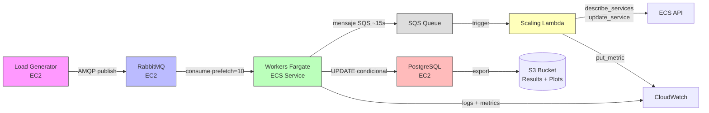

# AWSTicket — Scalable & Elastic Ticket Service

Distributed ticket-selling system on AWS with **strong consistency**, **elastic scaling**, and **asynchronous processing**.

## Architecture



### Components

| Component | Stack | Purpose |
|-----------|-------|---------|
| **Load Generator** | EC2 (Python) | Produces Z(t) workload: low, ramp, spike, sustained, cooldown |
| **Queue** | RabbitMQ EC2 | Async decoupling, load smoothing, backlog as scaling signal |
| **Workers** | Fargate ECS | Stateless consumers: dedup → payment delay → conditional UPDATE → ack |
| **Database** | PostgreSQL EC2 | Source of truth: seats, inventory, idempotency, results |
| **Scaler** | Lambda + SQS | Reads RabbitMQ backlog, computes desired workers, calls ECS API |
| **Monitoring** | CloudWatch + S3 | Dashboards, logs, benchmark results, plots |

## Key Results

| Experiment | Metric | Result |
|------------|--------|--------|
| **Calibration** | C (capacity/worker) | **9.49 rps** (prefetch=10 → ~38 rps) |
| **Speedup** | 1→8 workers | **4.81→30.46 rps** (efficiency 100%→79%) |
| **Contention** | Hotspot 80/5 penalty | **1.29×** vs uniform |
| **Elasticity** | p95 latency | **46s** (after SQS trigger fix; was 331s) |
| **Elasticity** | Sales improvement | **+31%** (11,880→15,900 tickets) |

## Quick Start

```bash
cd infra
terraform init && terraform apply -auto-approve

cd ../worker
docker build -t awsticket/worker .
docker tag awsticket/worker:latest $(terraform output -raw ecr_repository_url)
docker push $(terraform output -raw ecr_repository_url):latest

aws ecs update-service --cluster awsticket-cluster --service awsticket-worker-svc --force-new-deployment
```

See [`deploy.md`](deploy.md) for full instructions.

## Key Decisions

- **Strong consistency**: PostgreSQL row-level locking + conditional UPDATE → no overselling
- **Fargate over Lambda**: Persistent AMQP connections, bounded connection pool for PostgreSQL
- **SQS trigger over EventBridge**: Reduced scaling detection from 60s to ~15s
- **NAT Gateway**: Required for Lambda in VPC to reach ECS/CloudWatch APIs

## Architecture Pivot

The autoscaler originally used EventBridge (60s minimum interval). Combined with Fargate provisioning (60-90s), total response lag was ~150s, making the autoscaler ineffective. The fix: workers publish to SQS every ~15s, triggering the Lambda. A NAT Gateway was added to give the Lambda outbound internet access.
